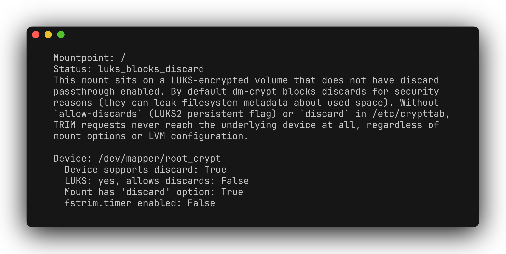

# trim-doctor

[](README.md) [](README.zh-CN.md)

Read-only Linux diagnostics for a mount point's SSD TRIM/discard configuration. It brings device capabilities, LUKS settings, LVM configuration and mount/timer checks into one report, highlighting the first blocking or undetermined layer. This also covers the common "whole-disk encryption with LVM on top" layout (Ubuntu/Debian installer's "Use LVM with encryption" option): a logical volume is never itself a LUKS device, so the tool separately checks whether the volume group's underlying physical volume is LUKS-encrypted and, if so, whether it allows discards.



[Demo video](docs/demo.mp4)

## Requirements and installation

Requires Linux and Python 3.9+, with `lsblk` and `findmnt` from util-linux. Encrypted/LVM setups also need `cryptsetup` and `lvs`/`pvs` (lvm2); the periodic-trim check uses `systemctl`. There are no Python runtime dependencies.

```bash
git clone https://github.com/zhuhroscar-tech/trim-doctor.git
cd trim-doctor
python3 -m venv .venv
source .venv/bin/activate
python -m pip install -e ".[dev]"
```

## Quick start

```bash
trim-doctor /
trim-doctor /home --json
trim-doctor --version
```

The report checks advertised discard support, LUKS discard flags/configuration, LVM `issue_discards`, and whether the mount has `discard` or `fstrim.timer` is enabled. Exit `0` means the tool's checks report a healthy chain; `2` covers both detected problems **and undetermined checks**. Read the status and explanation rather than treating every nonzero result as a proven blocker.

A standalone `trim-doctor.pyz` is available through [releases](https://github.com/zhuhroscar-tech/trim-doctor/releases). Verify it against that release's `SHA256SUMS.txt`, then run `python3 trim-doctor.pyz /`.

## Safety and interpretation

- Never runs `fstrim`, changes configuration, unlocks a volume or requests a passphrase. No network access or telemetry.
- Some device/header/LVM reads need root. The tool does not elevate itself; use elevated privileges only when needed for inspection.
- This is a configuration heuristic, **not an end-to-end test that discard reached the physical SSD**. LVM `issue_discards` governs discards issued by LVM operations and is not, by itself, proof of filesystem discard passthrough. Custom trim jobs and unusual storage topologies need manual review.
- Enabling discard on encrypted storage can reveal allocation patterns. Review that trade-off before changing settings; this tool makes no changes for you.

## Development and removal

```bash
python -m pytest -q
python -m pip uninstall trim-doctor
```

[Releases](https://github.com/zhuhroscar-tech/trim-doctor/releases) · [MIT license](LICENSE)
